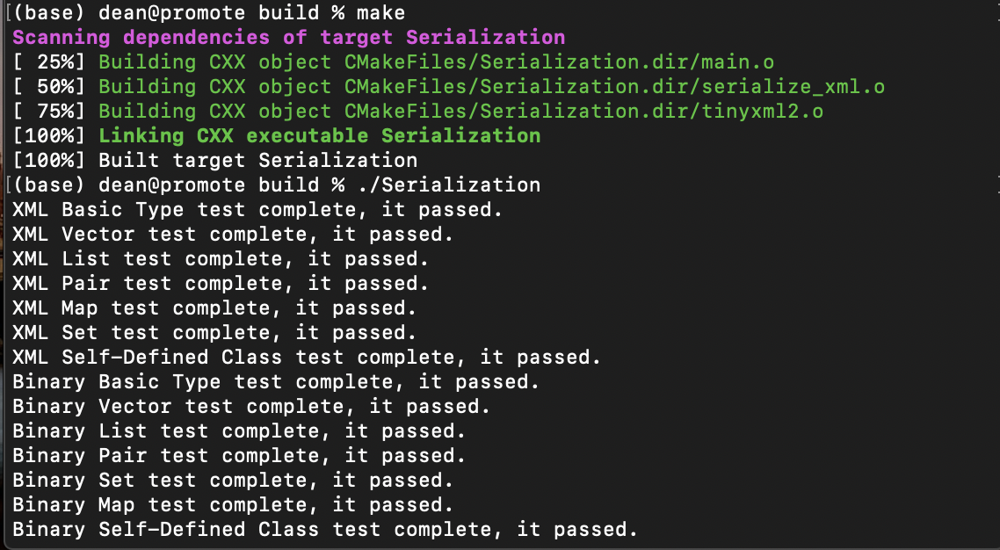

# A simple, convenient version of Serialization

### 分工

孙张诚：XML序列化，Bonus，Markdown

姜徐贝尔：二进制序列化

### Description

- We implement the binary version and XML version of serialization.
- Binary version is contained in Serialization.h , and XML version is contained in serialize_xml.h.
- We test all the contents required in the question, including all arithmetic contents, vector, map, pair, set, list,  and self-defined class.

### How to Use

To use the binary version of serialization, just include "Serialization.h" into the project, and compile them.

To use the XML version of serialization, you should include "serialize_xml.h" and "serialize_xml.cpp" into files and compile them.

### Examples

#### Vector

Here we use vector serialization as an example to show how the serialization works.

**Binary**:

```c++
vector<int> a{1, 2, 3, 4, 5}, b;
binary::serialize(a, filename_1);
binary::deserialize(b, filename_1);
assert(a.size() == b.size());
for (int i = 0; i < a.size(); i++) {
    assert(a[i] == b[i]);
}
```

**XML**:

```C++
vector<int> a{1, 2, 3, 4, 5}, b;
xmls::serialize(filename.c_str(),"test",a);
xmls::deserialize(filename.c_str(),"test",b);
assert(a.size() == b.size());
for (int i = 0; i < a.size(); i++) {
    assert(a[i] == b[i]);
}
```

### self-defined class

#### For binary version:

The struct is:

```C++
struct test_2{
    int a;
    string b;
    vector<float> c;
};
```

We should define a class inherited from Serializable class, and write two functions, serialize and deserialize.

The two functions just need to read a file and serialize each part.

```c++
class structtest: public binary::Serializable<structtest>,public test_2{
public:
    void serialize(structtest &m,const string &filename){
        ofstream output(filename, ios::binary);
        binary::serialize(m.a, output);
        binary::serialize(m.b, output);
        binary::serialize(m.c, output);
    }
    void deserialize(structtest &m,const string &filename){
        ifstream input(filename, ios::binary);
        binary::deserialize(m.a, input);
        binary::deserialize(m.b, input);
        binary::deserialize(m.c, input);
    }
};
```

And we can test it:

```C++
structtest m,m1;
m.a = 1;
m.b = "wow";
m.c = {1.2,2.3,3.4};
m.serialize(m, filename);
m1.deserialize(m1, filename);
```

#### XML version:

We use the same struct.

AND we implement two functions, insertXMLNode and getXMLNode.

**Notice: What we only need to change is the last three lines of code, the others could just copy and paste. This is the convenience.**

```C++
void insertXMLNode(XMLDocument* doc,XMLElement* Node,test& ex,string label = "example"){
    XMLElement*userNode = doc->NewElement(label.c_str());
    Node->InsertFirstChild(userNode);
    ex.userNode = userNode;
    xmls::insertXMLNode(doc, userNode,ex.a,"INT");
    xmls::insertXMLNode(doc, userNode,ex.b,"String");
    xmls::insertXMLNode(doc, userNode,ex.c,"Vector");
}

void getXMLNode(XMLElement* userNode,test &ex){
    userNode = userNode->FirstChildElement();
    xmls::getXMLNode(userNode, ex.a);
    userNode = userNode->NextSiblingElement("String");
    xmls::getXMLNode(userNode, ex.b);
    userNode = userNode->NextSiblingElement("Vector");
    xmls::getXMLNode(userNode, ex.c);
}
```

After implement the class, we can test it:

```C++
example m1,m2;
m1.a = 1;
m1.b = "string";
m1.c = {1.2,2.3,3.4};
    
m1.serialize(filename.c_str(),"example",m1);
m2.deserialize(filename.c_str(),"example",m2);
```


The successful running graph is included:



